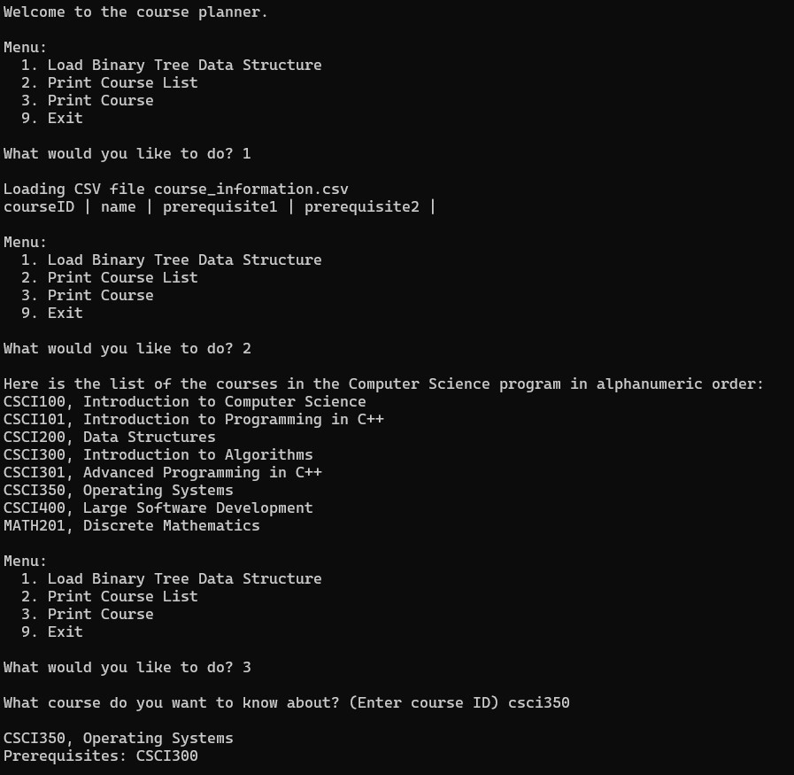

# Binary Search Tree Algorithm

<!-- PROJECT SHIELDS -->
<!--
*** I'm using markdown "reference style" links for readability.
*** Reference links are enclosed in brackets [ ] instead of parentheses ( ).
*** See the bottom of this document for the declaration of the reference variables
*** for contributors-url, forks-url, etc. This is an optional, concise syntax you may use.
*** https://www.markdownguide.org/basic-syntax/#reference-style-links
-->

<!-- TABLE OF CONTENTS -->

  
Table of Contents

  <ol>
    <li>
      <a href="#about-the-project">About The Project</a>
    </li>
    <li>
      <a href="#built-with">Built With</a>
    </li>
    <li>
      <a href="#getting-started">Getting Started</a>
    </li>
    <li><a href="#contact">Contact</a></li>
  </ol>

<!-- ABOUT THE PROJECT -->
## About The Project

This is a sample implementation of a binary search tree data structure and algorithm that sorts and prints out a list of the courses in the sample Computer Science program in alphanumeric order.

This program allows following functionalities:

Menu:
* Load Data Structure: Load the file data into the data structure. Note that before you can print the course information or the sorted list of courses, you must load the data into the data structure.
* Print Course List: This will print an alphanumeric list of all the sample courses in the Computer Science department.
* Print Course: This will print the course title and the prerequisites for any individual course.
* Exit: This will exit you out of the program.

The algorithm can be easily scaled up and modified to sort and search various large datasets. Included is the pseudocode for the implemented algorithm for loading the binary search tree alphanumerically,
searching for the using user-input course ID, print all elements in the tree in order, and print individual element in the tree (if it exists).  

(<a href="#readme-top">back to top</a>)

<!-- BUILT WITH -->
## Built with
 

  

(<a href="#readme-top">back to top</a>)

  

<!-- GETTING STARTED -->
## Getting Started

Download the files and save in a single folder, then run the BinarySearchTree.cpp file.

(<a href="#readme-top">back to top</a>)

<!-- CONTACT -->
## Contact

James Lee - [LinkedIn](https://www.linkedin.com/in/jhblee21/) - Jameshblee21@gmail.com

Project Link: [https://github.com/jhblee21/Binary-Search-Tree](https://github.com/jhblee21/Binary-Search-Tree)

(<a href="#readme-top">back to top</a>)

